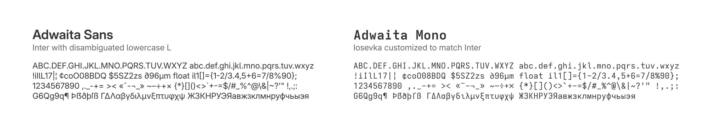

# Adwaita Fonts



This repository contains the Makefile used to build Adwaita Sans,
a variation of [Inter](https://rsms.me/inter/), and Adwaita Mono,
[Iosevka](https://typeof.net/Iosevka/) customized to match Inter.

## Getting the Fonts

### Prebuilt

You can download the latest builds of the fonts
[here](https://gitlab.gnome.org/GNOME/adwaita-fonts/-/pipelines).
Install them by opening the .ttf files and clicking on “Install”.

### Setting the Fonts

```sh
gsettings set org.gnome.desktop.interface font-name "Adwaita Sans 11"
gsettings set org.gnome.desktop.interface monospace-font-name "Adwaita Mono 11"
```

### Resetting Fonts

```sh
gsettings reset org.gnome.desktop.interface font-name
gsettings reset org.gnome.desktop.interface monospace-font-name
```
